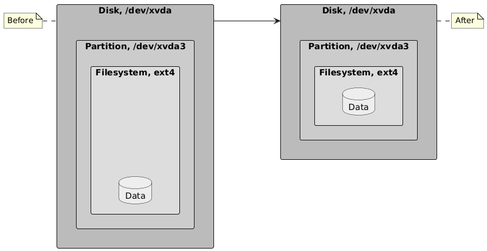
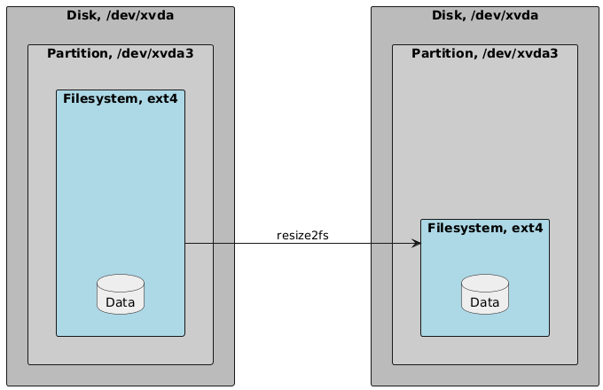
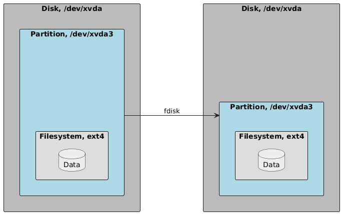
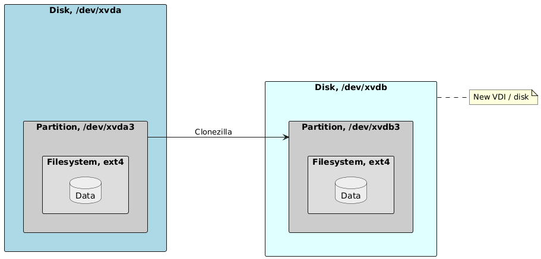

# How to shrink a filesystem/partition/disk

**NOTE**: This article does not apply to LVM, only to filesystems on
traditional partitions.



Let’s say we made a virtual machine with a 64 GiB disk and put everything in
it. Simple, but not very flexible. What if we need more space? What if we later
decide to use LVM? If we move all the space-consuming stuff out of that 64 GiB
disk and leave only the operating system, then that’s a whole lot of wasted
space.

We’ll take a 64 GiB disk and “shrink” it down to 32 GiB, one piece at a time.

For most of these operations, you will need to be booted into some sort of live
disk like Clonezilla.

## Step 0: Boot into Clonezilla

The root disk/partition cannot be in use for this process. The Clonezilla
environment contains all the tools we need.

## Step 1: Shrink the filesystem



First, check the filesystem to ensure it does not have any errors, and optimize
as recommended using `e2fsck`. Then, resize the underlying filesystem to 30
GiB—slightly smaller than our disk will be (32 GiB). This is to give us enough
wiggle room so we can successfully copy the filesystem somewhere else. We will
later expand it to fill up the remaining space in our 32 GiB disk.

Let's assume `/dev/xvda3` is your root partition. You can run the following
commands to perform these operations. Accept all the recommended actions.

```sh
e2fsck -f /dev/xvda3
resize2fs /dev/xvda3 30G
```

## Step 2: Shrink the partition



1. Use `fdisk /dev/xvda`.
2. Print out the current partition layout using `p.` Take note of the start
   sector for `/dev/xvda3`. You will need it in a moment.
3. Delete `/dev/xvda3` with `d.` Follow the prompts, and ensure you are
   deleting the correct partition.
4. Create a new partition with `n`.
   1. Use the same position as before (i.e. position `3`).
   2. For the start sector, provide the exact same start sector as before.
   3. For the size, specify `+31G`.
   4. _Do not_ delete the existing ext4 filesystem signature if `fdisk` asks you.
5. Write the changes.
6. Run `e2fsck -f` against the filesystem again, and accept any recommendations
   it has.

## Step 3: Clone the disk



1. Attach a new, empty 32 GiB disk to the machine.
2. Start Clonezilla.
3. Do a device-to-device clone in Expert mode (`disk_to_local_disk`).
4. In the list of additional options, leave all the defaults checked, and
   additionally enable the `-icds` option, "Skip checking destination disk size
   before creating partition table".
5. When the clone is completed, go back to a terminal and run
   `resize2fs /dev/xvda3`. This will expand the filesystem to use up all the
   remaining space in the partition.

## Step 4: Shuffle the disk positions (optional)

However it makes sense for you in your hypervisor, delete or disconnect the
original root disk, then move the _new_ one into that position. Make sure your
`/etc/fstab` uses UUID's rather than paths in `/dev`.
